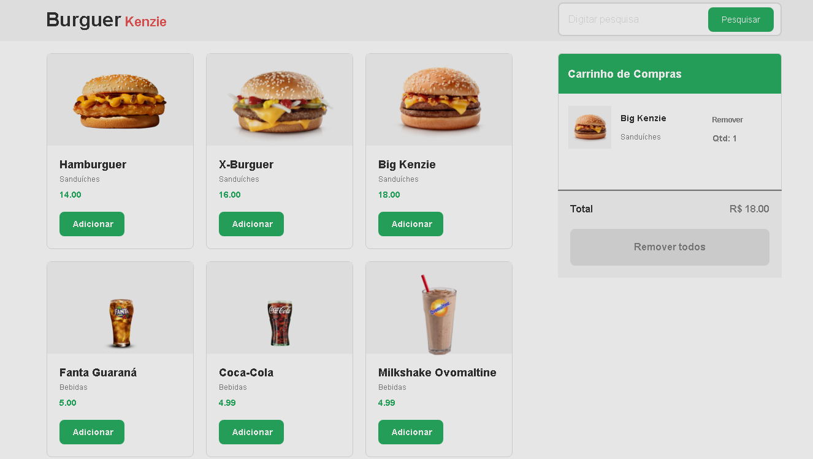

# Hamburguer Shop
# Sobre o projeto
<a href="https://react-entrega-s1-hamburgueria-da-kenzie-cesarrafaeljunior-19.vercel.app/">Visualizar projeto</a>
Hamburguer Shop é um projeto simples acadêmico desenvolvido utilizando React básico, o app simula um e-commerce de uma hamburgueria, onde o usuário é capaz de adicionar e remover produtos do carrinho, a quantidade do produto é alterada dinamicamente ao tentar adicionar mais de um do mesmo produto, o valor total da compra também é alterado dinamicamente a depender da quantidade de items adicionados no carrinho.

# Layout do projeto

# Tecnologias utilizadas
- HTML/CSS/JavScript
- React

# Implantaçao em produção
- Vercel

# Autor
César Rafael da Silva Júnior
Linkedin => https://www.linkedin.com/in/cesarrafaeljunior/
